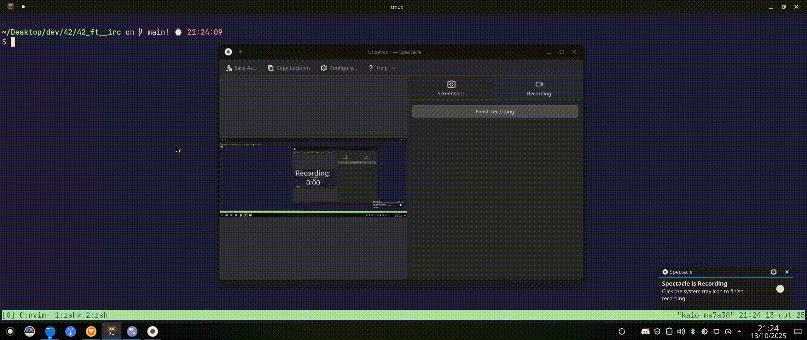

# 42_ft\_\_irc

IRC server in C++98, compatible with a standard IRC client for the required features.



## Running

```
docker compose up -d
docker compose exec server ./ircserv 8080 secret
# connect with a client
docker compose exec server node ./testers/CreateClient.mjs john john
# inside the running script
# the script will automatically join the user to the #games group, so you can send a message to everyone in that group
PRIVMSG #games :Group chat message -> Hello Kaio!
```

To test the compatibility with a official IRC chat you may download Weechat:

- Directly from their website <https://weechat.org/download/>
- Or with some package manager like `pacman`

After installing Weechat you can run the following commands to test the integration:

```
weechat
# inside weechat:

/server add irc localhost/8080 -password=secret -notls

/connect irc
/join #games
# send some message
```

### Requirements

- [x] port: The port number on which your IRC server will be listening to for incoming IRC connections.
- [x] password: The connection password. It will be needed by any IRC client that tries to connect to your server.
- [x] The server must be capable of handling multiple clients at the same time and never hang.
- [x] Forking is not allowed. All I/O operations must be non-blocking.
- [x] Only 1 poll() (or equivalent) can be used for handling all these operations (read, write, but also listen, and so forth).
- [x] Several IRC clients exist. You have to choose one of them as a reference. Your reference client will be used during the evaluation process.
- [x] Your reference client must be able to connect to your server without encountering any error.
- [x] Communication between client and server has to be done via TCP/IP (v4 or v6).
- [x] Using your reference client with your server must be similar to using it with any official IRC server. However, you only have to implement the following features:
  - [x] You must be able to authenticate, set a nickname, a username, join a channel, send and receive private messages using your reference client.
  - [x] All the messages sent from one client to a channel have to be forwarded to every other client that joined the channel.
  - [x] You must have operators and regular users.
  - [x] Then, you have to implement the commands that are specific to channel operators:
    - [x] KICK - Eject a client from the channel
    - [x] INVITE - Invite a client to a channel
    - [x] TOPIC - Change or view the channel topic
    - [x] MODE - Change the channel’s mode:
      - [x] i: Set/remove Invite-only channel
      - [x] t: Set/remove the restrictions of the TOPIC command to channel operators
      - [x] k: Set/remove the channel key (password)
      - [x] o: Give/take channel operator privilege
      - [ ] l: Set/remove the user limit to channel
- [x] Of course, you are expected to write a clean code.
